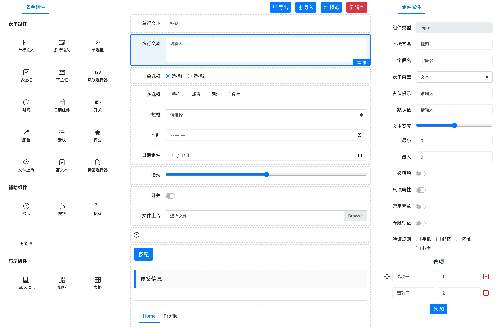

# bsFormBuilder

一个基于 Bootstrap (v4.x) + JQuery 的、拖拽的表单构建工具。



## 演示

- 演示站点：[http://bsformbuilder.jpress.cn](http://bsformbuilder.jpress.cn)
- 推荐一个代码格式化工具：[http://www.codeformat.cn](http://www.codeformat.cn)


## 特点

- 1、基于 Bootstrap (v4.x) + JQuery，简单易用
- 2、拖动的 html 组件，支持通过 Json 自定义扩展
- 3、组件的属性面板，支持通过 Json 自定义扩展
- 4、支持导出 html 和 json，然后自己通过 json 来构建 UI 页面
- 5、支持导入 json 到 bsFormBuilder，用来进行二次编辑
- 6、丰富的 API，方便二次开发和扩展
- 7、支持 “模板” 功能，可以选择已有模板进行二次开发
- 8、内置轻量的 html 渲染引擎，速度极快，极好用~~

## 快速使用

```html
<div id="builder"></div>
<script>
    $('#builder').bsFormBuilder({...});
</script>
```

在使用前，需要导入 bootstrap 和 jquery 的相关文件。

```html
<link href="path/bootstrap.min.css" rel="stylesheet">
<link href="path/bootstrap-icons.css" rel="stylesheet">

<script src="path/jquery.min.js"></script>
<script src="path/bootstrap.bundle.min.js"></script>

<!-- 导入 bs-form-builder 依赖-->
<link href="path/bs-form-builder.min.css" rel="stylesheet">
<script src="path/bs-form-builder.min.all.js"></script>
```

## 开发文档

### 1、初始化

通过 `$('#builder').bsFormBuilder({options...});` 进行初始化，`bsFormBuilder` 方法可以传入 options 配置，options 内容如下：

```javascript
{
  //模式: "view" 预览模式, "builder" 构建工具模式，默认值为 builder
  mode: "builder",
  bsFormContainerSelector: ".bsFormContainer", // 设计容器
  bsFormContainerFilterSelector: ".bsFormFilter", // 设计容器里，不允许拖动的组件 class
  bsFormContainerSortableGroup: "shared", // 配置主容器里的 group 名称
  bsFormContainerPlaceHolderSelector: ".bsFormContainer-placeholder", // 设计容器里的提示内容
  bsFormPropsSelector: ".bsFormProps", // 面板内容
  bsFormPropsTitleSelector: ".bsFormPropsTitle", // 面板标题
  customBuilderStructure: false, // 自定义容器面板
  onDataChange:null, //监听数据更新（更新之前）
  onDataChanged:null, //监听数据更新（更新之后）
  //使用哪些组件
  useComponents:[],
  customRender:null, //支持自定义渲染方法，或者服务端渲染
  optionsDatasources: null, // 定义数据源      
  //初始化数据
  datas:[],
  //操作按钮列表      
  actionButtons:[],
  //操作按钮模板
  actionButtonTemplate:'',     
  //组件扩展配置，配置的内容可以覆盖掉系统的配置
  components: {},
  //每个组件的默认属性
  defaultProps: [],
  //属性渲染的 html 模板配置
  propTemplates: {},
  //初始化回调方法
  onInit: function(bsFormBuilder){},
}
```


### 2、方法调用

- 1、通过 `$('#builder').bsFormBuilder('methodName',arguments...);` 方法调用。


- 2、或者可以通过 `$('#builder').bsFormBuilder().data('bsFormBuilder')` 来获取 `bsFormBuilder` 实例，然后直接调用其方法。


**bsFormBuilder 支持的方法如下：**

- init： 初始化，bsFormBuilder 自动调用
- render(data, withActive)：通过 data 数据，来渲染出一个 html 内容
- renderDefault(data)： 系统内置的默认渲染方法，当 component 未定义自己的 render 方法的时候，使用该方法进行渲染。
- deepCopy(target, withNewElementIdAndId)：深度拷贝工具类
- createComponentData(component)：通过 component 来创建 data 数据
- genRandomId()：生成一个随机的 id
- makeFormItemActive(elementId)：设置选择状态
- deleteFormItem(elementId)：删除一个 formItem
- copyFormItem(elementId)：复制一个 formItem
- getDataByElementId(elementId)：通过一个节点 id 获取 data 数据
- removeDataByElementId(elementId)：通过节点 id 移除 data 数据
- getParentArrayByElementId(elementId)：通过节点 id 获取其所在的 数组
- refreshDataIndex($parentElement)：刷新 data 的 index 属性
- refreshPropsPanel()：渲染（刷新）属性面板
- renderPropTemplate(prop, data, template)：渲染属性模板
- exportToJson()：导出 json 数据
- exportToHtml()：导出 html 数据
- getDatas()：获取 datas 数据，并可以对其进行修改
- addDataToRoot(data)：添加一个 data 到根节点
- addDatasToRoot(array)：添加一个 data 数组到根节点
- addDataToContainer(data, containerElementId, index)：添加一个 data 到一个子container
- addDatasToContainer(array, containerElementId, index)：添加一个 data 数组到一个子container
- updateDataAttr(data, attr, value)：更新一个 data 的属性，并同步到 html 显示
- refreshDataElement(data)：刷新 data 数据到 html
- isViewMode()：是否是视图模式
- isBuilderMode()：是否是构建模式（构建工具）
- clear()：清空设计的所有内容，然后可以重新设计
- destroy()：销毁整个组件

### 3、组件扩展

在 bsFormBuilder 中，组件是通过一个 json 内容来定义的，一个完整的组件的 json 内容
如下：

```javascript
{
    "name": "输入框",
    "tag": "input",
    "drag": {
            "title": "输入框",
            "type": "base",
            "index": 100,
            "icon": "bi bi-terminal"
         },
    "template": '<div class="bsFormItem">' +
                '  <div class="form-group clearfix">' +
                '    <div class="form-label-left">' +
                '      <label for="label">{{label}}</label>' +
                '    </div>' +
                '    <div class="flex-auto">' +
                '      <input type="text" class="form-control" id="{{id}}"' +
                '        placeholder="{{placeholder}} value="{{value}}" />' +
                '    </div>' +
                '  </div>' +
                '</div>',
}
```

**组件属性描述**
- name：组件名称
- tag:  组件 tag，全局唯一，若用户定义的组件 tag 与系统一样，则会覆盖系统的组件定义。
- drag：右侧显示的内容
- props：组件支持的属性配置
- propsfilter：系统属性过滤配置，若为配置则显示系统存在的 props 定义
- withOptions：该属性是否带有 options 配置
- defaultOptions：options 的默认配置值
- optionsDatasourceGroupName：options 的数据源分组名称，必须是初始化 bsFormBuilder 时配置的 optionsDatasourceGroups 中的一个
- template：模板，可以是一个 string 字符串，也可以是一个返回一个 string 的 function(component, data)。
- onAdd：当组件被添加到 html 的时候回调，或者被拖动的时候，注意：当组件从一个子容器被拖动到另一个子容器，也会调用此方法。
- onPropChange：当属性被修改的时候，回调。

> **注意**：默认情况下，无需配置 onAdd、onPropChange 方法。除非您已经了解的其作用。

**props 属性描述**

bsFormBuilder 已经内置了 4 个属性：tag、id、name、label，任何组件都包含有这 4 个属性（除非定义了 propsfilter），然而，一个复杂的组件除了这 4 个属性以外，还应该有其他的属性，比如 textarea 应该有行数 rows。

所以，textarea 组件的定义如下：

```javascript
{
    "name": "多行输入框",
    "tag": "textarea",
    "props": [
        {
            name: "rows",
            type: "number",
            label: "行数",
            placeholder: "请输入行数...",
            defaultValue: 3,
            disabled: false,
            required: true,
        }
    ],
     "template":"...."   
}
```

**template 语法：**

- 输出：{{attr}} 
- for循环：{{~ for(let item of array)}}  -{{item.name}}-  {{~end}}
- if循环：{{~ if( x === "string")}}  -{{x}}-  {{~end}}
- if-elseif-else循环：{{~ if( x === "string")}} - {{~elseif(x === "other")} - {{~else}} - {{~end}}

**template 内置变量：**
- $builder : bsFormBuilder 实例
- $component：component 实例
- $data：当前 component 的数据
- $children：html 数组，若当前是一个容器，那么该容器下的 html 内容。

**props 描述**
props 是一个组件的属性配置，系统内置了 4 个属性，我们可以通过这个来定义组件自己的属性。

例如，textarea 需要定义行号属性，因此，需要添加如下的配置：

```javascript
{
    name: "rows",
    type: "input",
    label: "行数",
    placeholder: "请输入行数...",
    defaultValue: 5,
    disabled: false,
    required: true,
}
```

textarea 定义了名称为 rows 的属性，template 必须通过 `{{rows}}` 来接收该属性的设置：

```html
<textarea rows="{{rows}}">{{value}}</textarea>
```

**prop 属性描述**

- name: 属性名称
- type: 属性渲染类型，支持有：input/select/number/switch/checkbox/radio/none，可以扩展其他属性类型，或者复写这些属性的默认行为。
- label: 属性在面板里的label
- placeholder: 属性里 placeholder 内容
- defaultValue: 属性的默认值
- disabled: 属性面板里是否启用
- required: 属性面板里是否必填

### 4、属性扩展

理论上，属性面板支持 input、select、number、switch、checkbox、radio 这 6 种属性类型，已经够用了，不过 
bsFormBuilder 依然支持通过在初始化的时候，通过初始化函数来扩展自己的属性面板设置类型。

属性扩展如下：

```javascript
var options = {
    propTemplates: {
        otherType:function (){
            return '<div> </div>'
        }
    },
    defaultProps:[
        {
            name: "属性名称",
            type: "otherType",
            label: "属性label",
            placeholder: "请输入行数..."
        }
    ]
}
$('#builder').bsFormBuilder(options)
```

或者

```javascript
var options = {
    propTemplates: {
        otherType:function (){
            return '<div> </div>'
        }
    },
    components:{
        component1 :{
            "name": "自定义组件1",
            "tag": "component1",
            "props": [
                {
                    name: "属性名称1",
                    type: "otherType",
                    label: "属性名称1",
                }
            ],
            "template":"...."
        },
        component2 :{
            "name": "自定义组件2",
            "tag": "component2",
            "props": [
                {
                    name: "属性名称2",
                    type: "otherType",
                    label: "属性名称2",
                }
            ],
            "template":"...."
        }
    }
}
$('#builder').bsFormBuilder(options)
```

### Options 数据源

在很多场景下，一些组件（比如复选框、下拉菜单等）的内容不是写死的，也不是自定义的，而是来之某个 API 接口，或者说来源于某个 "数据源"。此时，我们要做
一下配置：

1、在初始化 bsFormBuilder 的时候，定义好数据源列表，例如：

```javascript
var options = {
    optionsDatasources:[
                {
                    text: "数据源1", value: "ds1", 
                    options: [
                        {text: "aaa1", value: "value"}
                    ]
                },
                {
                    text: "数据源2", value: 'ds2', 
                    options: [
                        {text: "bbb1", value: "value1"},
                        {text: "bbb2", value: "value2"}
                    ]
                },
                {
                    text: "数据源3", value: "ds3", 
                    options: function (){
                        return ["..."]
                    }
                },
                {
                    text: "数据源4", value: "ds4", 
                    options: "http://www.***.com/***.json"
                }
          ]
}

$('#builder').bsFormBuilder(options);
```
数据结构说明：

* 1、optionsDatasources 里有多个数据源，可以配置为 array、function、url (String类型)
* 2、数据源有 3 个字段： text / value / options 
* 3、每个数据源通过 options 字段来定义数据集合
* 4、数据（option）是由 value 和 text 组成的

> PS:
> - 1、optionsDatasources 可以配置为一个 url 地址(要求返回 json，json 内容必须有 datasources 字段来描述数据源数据)。
> - 2、数据源里的 options 字段，可以是一个数据集合，也可以是一个 function，或者一个 url 地址 (要求返回 json，json 内容必须有 options 字段来描述数据)。

当配置 optionsDatasources 字段后，属性面板会多出一个 "选项类型" 的下拉菜单，用户让用户选择自定义选项，还是使用数据源。


## 二次开发

1、下载代码

```shell
git clone https://gitee.com/fuhai/bsFormBuilder.git
```

2、安装依赖

```shell
npm install
```

> PS：在安装依赖的过程中，可能会出现网络错误，请配置好网络环境，或者多安装几次...

3、构建编译生成 dist 文件

```shell
npm run build
```

## 交流社区

QQ群：117662146
